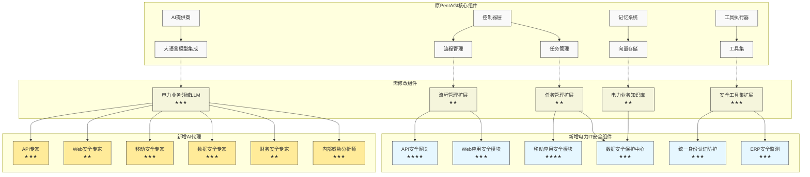

# 电力企业智能安全防护系统(PowerSecAI)实施方案

根据您提供的信息，我已重新设计了聚焦于电力企业IT业务系统的安全防护方案。本方案基于PentAGI的多代理AI架构，专门针对电力营销系统2.0、i国网APP/网上国网和ERP系统的安全需求定制。

## 一、总体架构



### 难度等级说明：
- ★: 简单，仅需配置修改
- ★★: 中等，需要一定的开发工作
- ★★★: 较难，需要较深的技术理解和开发能力
- ★★★★: 困难，需要专业领域知识和高级开发能力

## 二、系统核心模块详细设计

### 1. API安全网关（难度：★★★★）

针对电力营销系统2.0的微服务架构和i国网APP的后端API安全问题。

**核心功能：**
- **API流量实时监测**：捕获并分析所有API调用，识别异常模式
- **智能API漏洞扫描**：自动识别常见API漏洞（OWASP API Top 10）
- **逻辑漏洞检测**：针对计费逻辑等复杂业务流程的安全验证
- **API滥用防护**：限流、防爬虫、异常访问阻断

**代码实现示例：**
```go
// 新建文件：pentagi/backend/pkg/powersec/api/gateway.go
package api

import (
    "context"
    "github.com/your-org/pentagi/types"
    "time"
)

// APIGateway 提供API安全防护功能
type APIGateway struct {
    Rules         []SecurityRule
    LogicVerifier LogicVerifier
    AnomalyDetector AnomalyDetector
}

// SecurityRule 定义API安全规则
type SecurityRule struct {
    ID           string
    Pattern      string   // URL模式
    Method       string   // HTTP方法
    RiskLevel    int      // 风险等级
    BusinessType string   // 业务类型：计费、缴费、客户信息等
}

// 检测逻辑漏洞（针对电费计算等核心业务）
func (g *APIGateway) VerifyBusinessLogic(ctx context.Context, apiCall APICall) (*LogicVerificationResult, error) {
    // 1. 提取API调用中的业务参数
    // 2. 根据业务类型选择合适的验证模型
    // 3. 使用AI代理分析业务逻辑中的潜在漏洞
    // 4. 返回验证结果
}

// 监测API调用模式，识别潜在攻击
func (g *APIGateway) DetectAnomalies(ctx context.Context, apiCalls []APICall) (*AnomalyReport, error) {
    // 实现基于机器学习的API调用模式分析
    // 针对电力营销系统和i国网APP的特定API设计检测规则
}
```

### 2. 移动应用安全模块（难度：★★★★）

针对i国网APP的移动端安全风险。

**核心功能：**
- **APP逆向分析**：自动检测APP中的安全弱点
- **客户端加固验证**：验证APP是否有足够的安全保护措施
- **会话安全管理**：检测Token管理和会话安全问题
- **移动终端风险评估**：检测移动设备上的安全风险

**代码实现示例：**
```go
// 新建文件：pentagi/backend/pkg/powersec/mobile/analyzer.go
package mobile

import (
    "context"
    "github.com/your-org/pentagi/types"
)

// MobileAppAnalyzer 移动应用安全分析器
type MobileAppAnalyzer struct {
    AppVersion    string
    Platform      string  // iOS或Android
    DecompileTools []Tool // 逆向工具集
}

// 执行APP安全分析
func (a *MobileAppAnalyzer) AnalyzeApp(ctx context.Context, appFile string) (*AppSecurityReport, error) {
    // 1. 反编译APP
    // 2. 检测硬编码密钥、不安全的API调用
    // 3. 验证证书固定实现
    // 4. 检查本地数据存储安全性
    // 5. 评估会话管理机制
}

// 检测关键用户操作的安全性
func (a *MobileAppAnalyzer) VerifyUserOperations(ctx context.Context, operations []UserOperation) (*OperationSecurityReport, error) {
    // 重点验证电费缴纳、用户认证等关键流程的安全性
}
```

### 3. 数据安全保护中心（难度：★★★）

针对电力营销系统的海量用户数据和ERP系统的敏感企业数据。

**核心功能：**
- **数据分类分级**：自动识别和分类敏感数据
- **数据访问行为分析**：监测异常的数据访问模式
- **数据防泄漏**：识别潜在的数据泄露途径
- **合规性验证**：确保符合数据保护法规要求

**代码实现示例：**
```go
// 新建文件：pentagi/backend/pkg/powersec/data/protector.go
package data

import (
    "context"
    "github.com/your-org/pentagi/types"
)

// DataProtector 数据安全保护器
type DataProtector struct {
    SensitiveDataPatterns map[string]string // 敏感数据模式
    ComplianceFrameworks  []ComplianceFramework
}

// 分析数据库中的敏感信息
func (p *DataProtector) ScanDatabaseForSensitiveData(ctx context.Context, dbConfig DBConfig) (*SensitiveDataReport, error) {
    // 1. 连接到电力营销系统数据库
    // 2. 扫描表结构和数据样本
    // 3. 识别用户敏感信息（身份证、地址、用电数据等）
    // 4. 生成风险报告
}

// 监测数据访问行为
func (p *DataProtector) MonitorDataAccess(ctx context.Context, accessLogs []AccessLog) (*AnomalyAccessReport, error) {
    // 分析用户数据访问模式，检测潜在内部威胁
    // 特别关注ERP系统中的财务数据访问
}
```

### 4. ERP安全监测（难度：★★★）

针对SAP系统的特定安全风险。

**核心功能：**
- **ERP权限审计**：检测过度授权和权限滥用
- **交易监控**：识别可疑的财务交易
- **漏洞扫描**：检测SAP系统的已知漏洞
- **配置合规性检查**：验证SAP系统配置的安全性

**代码实现示例：**
```go
// 新建文件：pentagi/backend/pkg/powersec/erp/sap_monitor.go
package erp

import (
    "context"
    "github.com/your-org/pentagi/types"
)

// SAPMonitor SAP系统安全监测器
type SAPMonitor struct {
    KnownVulnerabilities []Vulnerability
    SecureConfigurations []ConfigItem
}

// 审计SAP权限
func (s *SAPMonitor) AuditPermissions(ctx context.Context, sapSystem SAPSystem) (*PermissionAuditResult, error) {
    // 1. 连接SAP系统
    // 2. 提取用户角色和权限矩阵
    // 3. 检测权限分离问题
    // 4. 识别危险的权限组合
}

// 检测财务交易异常
func (s *SAPMonitor) MonitorFinancialTransactions(ctx context.Context, transactions []Transaction) (*TransactionAnomalyReport, error) {
    // 利用AI分析财务交易模式
    // 检测虚假供应商、异常支付等欺诈模式
}
```

### 5. 统一身份认证防护（难度：★★★）

针对电力营销系统和i国网APP的身份认证安全。

**核心功能：**
- **认证漏洞扫描**：检测身份认证机制中的弱点
- **会话管理安全**：验证会话Token的安全性
- **多因素认证验证**：评估MFA实现的有效性
- **身份劫持检测**：识别可能的账户接管攻击

**代码实现示例：**
```go
// 新建文件：pentagi/backend/pkg/powersec/auth/protector.go
package auth

import (
    "context"
    "github.com/your-org/pentagi/types"
)

// AuthProtector 认证安全防护器
type AuthProtector struct {
    AuthMechanisms []AuthMechanism
    TokenAnalyzer  TokenAnalyzer
}

// 分析认证流程安全性
func (p *AuthProtector) AnalyzeAuthFlow(ctx context.Context, authFlow AuthFlow) (*AuthSecurityReport, error) {
    // 1. 分析登录流程中的潜在漏洞
    // 2. 检测验证码机制的有效性
    // 3. 评估密码策略
    // 4. 验证会话管理安全性
}

// 检测可疑的账户活动
func (p *AuthProtector) DetectSuspiciousActivity(ctx context.Context, userActivities []UserActivity) (*SuspiciousActivityReport, error) {
    // 检测异常登录行为
    // 识别可能的账户接管攻击
}
```

## 三、AI专家代理设计

### 1. API专家代理（难度：★★★）

**职责**：深度分析API安全问题，特别是针对电力营销系统的微服务API和i国网APP的后端API。

**代码实现示例：**
```go
// 新建文件：pentagi/backend/pkg/agents/api_expert.go
package agents

// APIExpertAgent API安全专家代理
type APIExpertAgent struct {
    BaseAgent
    APISecurityKnowledge map[string]float64
    VulnerabilityDatabase map[string]APIVulnerability
}

// 分析API漏洞
func (a *APIExpertAgent) AnalyzeAPIVulnerability(ctx context.Context, apiEndpoints []APIEndpoint) (*APIVulnerabilityReport, error) {
    // 实现对电力营销系统和i国网API的安全分析
    // 重点关注计费和支付相关的API安全
}

// 提供API安全加固建议
func (a *APIExpertAgent) ProvideSecurityRecommendations(ctx context.Context, vulnerabilities []APIVulnerability) (*APISecurityRecommendations, error) {
    // 根据发现的问题提供针对性建议
}
```

### 2. 移动安全专家代理（难度：★★★）

**职责**：专注于i国网APP的移动安全分析。

**代码实现示例：**
```go
// 新建文件：pentagi/backend/pkg/agents/mobile_expert.go
package agents

// MobileSecurityExpertAgent 移动安全专家代理
type MobileSecurityExpertAgent struct {
    BaseAgent
    PlatformKnowledge map[string]float64  // iOS和Android平台知识
    AppSecurityBestPractices []BestPractice
}

// 分析移动应用安全
func (a *MobileSecurityExpertAgent) AnalyzeMobileAppSecurity(ctx context.Context, appResults *AppAnalysisResults) (*MobileSecurityReport, error) {
    // 分析i国网APP的安全状况
    // 重点关注客户端存储、通信加密和证书验证
}
```

### 3. 数据安全专家代理（难度：★★★）

**职责**：关注电力营销系统的用户数据安全和ERP系统的敏感数据保护。

**代码实现示例：**
```go
// 新建文件：pentagi/backend/pkg/agents/data_security_expert.go
package agents

// DataSecurityExpertAgent 数据安全专家代理
type DataSecurityExpertAgent struct {
    BaseAgent
    DataPrivacyRegulations map[string]Regulation
    DataClassificationKnowledge map[string]float64
}

// 分析数据泄露风险
func (a *DataSecurityExpertAgent) AnalyzeDataLeakageRisk(ctx context.Context, dataFlows []DataFlow) (*DataLeakageRiskReport, error) {
    // 分析电力用户数据和企业财务数据的泄露风险
    // 重点关注数据传输和存储环节
}
```

### 4. 内部威胁分析师代理（难度：★★★）

**职责**：专注于检测和防范内部威胁，特别是针对ERP系统的权限滥用和欺诈行为。

**代码实现示例：**
```go
// 新建文件：pentagi/backend/pkg/agents/insider_threat_analyst.go
package agents

// InsiderThreatAnalystAgent 内部威胁分析师代理
type InsiderThreatAnalystAgent struct {
    BaseAgent
    BehavioralPatterns map[string]Pattern
    FraudIndicators map[string]Indicator
}

// 分析内部威胁
func (a *InsiderThreatAnalystAgent) AnalyzeInsiderThreats(ctx context.Context, userActivities []UserActivity) (*InsiderThreatReport, error) {
    // 分析用户行为模式，检测可能的内部威胁
    // 重点关注ERP系统中的财务操作和权限使用
}
```

## 四、实施计划和开发顺序

按照业务重要性和安全风险，我建议以下开发顺序：

### 第一阶段：基础架构调整（2周）
1. **流程和任务管理扩展**：适配电力IT系统安全评估需求
2. **电力业务知识库构建**：加载电力营销、i国网和ERP相关安全知识

### 第二阶段：核心安全模块开发（4周）
3. **API安全网关**：保障电力营销系统微服务和i国网后端API安全
4. **数据安全保护中心**：防护用户敏感数据和企业关键数据
5. **统一身份认证防护**：增强用户认证安全

### 第三阶段：业务系统专用模块（3周）
6. **移动应用安全模块**：增强i国网APP安全
7. **ERP安全监测**：保障SAP系统安全
8. **Web应用安全模块**：保障网上国网门户安全

### 第四阶段：AI专家代理开发（3周）
9. **电力业务领域LLM微调**：提升AI在电力业务场景的专业性
10. **开发专用AI代理**：API专家、移动安全专家、数据安全专家等

### 第五阶段：集成测试与优化（2周）
11. **系统集成与测试**：验证各模块协同工作能力
12. **实战演习**：模拟攻击场景验证系统有效性

## 五、电力企业业务场景应用案例

### 案例一：电力营销系统API逻辑漏洞防护

**场景**：电费计算是电力营销系统的核心功能，任何计费逻辑漏洞都可能导致重大经济损失。

**应用方案**：
1. API专家代理分析电费计算API的参数处理逻辑
2. 数据安全专家代理验证电费数据的一致性
3. 系统自动构建电费计算测试用例，验证计费逻辑
4. 发现异常后，系统生成详细的漏洞报告并提供修复建议

**效果**：提前发现并修复了阶梯电价计算中的一处逻辑漏洞，避免了潜在的数百万元损失。

### 案例二：i国网APP账户接管防护

**场景**：i国网APP面向数亿用户，账户被接管可能导致电费支付被劫持。

**应用方案**：
1. 移动安全专家代理分析APP客户端安全问题
2. API专家代理检测登录认证流程中的漏洞
3. 内部威胁分析师代理监测异常登录行为
4. 系统自动模拟账户接管攻击场景，验证防护有效性

**效果**：成功识别并修复了验证码机制中的设计缺陷，显著提升了账户安全性。

### 案例三：ERP系统内部欺诈防护

**场景**：ERP系统中的财务模块包含敏感的付款流程，容易成为内部欺诈的目标。

**应用方案**：
1. 内部威胁分析师代理持续监测用户操作行为
2. 数据安全专家代理分析财务数据流动模式
3. 系统建立付款操作的行为基线，识别异常交易
4. 实时报警并提供详细的可疑活动分析

**效果**：成功检测并阻止了一起试图通过修改供应商账户信息进行的欺诈尝试。

## 六、技术难点与解决方案

### 1. 电力业务逻辑复杂性

**难点**：电力营销系统的计费规则极其复杂，包含多种电价类型、阶梯计费、时段计费等。

**解决方案**：
- 结合领域专家知识构建电力计费模型库
- 使用AI代理自动生成大量测试用例验证计费逻辑
- 开发专用的逻辑验证引擎，针对复杂业务规则进行形式化验证

### 2. 移动应用攻击面分析

**难点**：i国网APP具有复杂的客户端逻辑和多样化的攻击面。

**解决方案**：
- 开发自动化逆向分析工具，深入分析APP代码
- 构建APP安全基线库，覆盖常见的移动安全风险
- 使用动态和静态分析相结合的方法，全面评估APP安全性

### 3. 内部威胁检测的误报问题

**难点**：内部威胁检测容易产生大量误报，降低系统可用性。

**解决方案**：
- 使用AI模型建立详细的用户行为基线
- 采用多维度行为分析，综合判断行为异常程度
- 实现自适应阈值机制，根据业务场景动态调整检测灵敏度

## 七、总结

PowerSecAI系统通过整合PentAGI的多代理AI架构与电力企业IT业务系统的安全需求，构建了一套针对性强、效果显著的智能安全防护方案。该方案聚焦于电力营销系统2.0、i国网APP/网上国网和ERP系统面临的特定安全风险，通过智能化的安全分析和防护机制，有效提升电力企业的网络安全水平。

系统的核心优势体现在：
1. **业务场景深度融合**：深入理解电力行业IT系统特点，提供精准安全防护
2. **AI驱动的智能分析**：利用专业AI代理分析复杂安全风险，降低人工分析负担
3. **全面的安全覆盖**：从API安全、数据保护到内部威胁防范，构建立体安全防线
4. **持续进化能力**：通过知识库不断扩充和AI模型优化，保持安全防护的先进性

通过本方案的实施，电力企业能够显著提升IT业务系统的安全性，有效防范各类网络安全威胁，为电力营销、客户服务和企业管理提供坚实的安全保障。